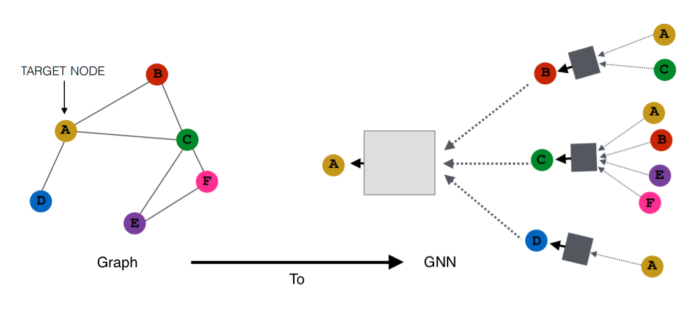

# Graph2GNN
Graph2GNN is a library that helps you prepare data from a graph database for use in training graph-based machine learning models.


Example of a GCN from Ying et al., 2018[^1]

## Overview
Graph2GNN in 3 sentences... Write a query (with the guidance in the docs) to get data in your graph. Graph2GNN will take care of extracting the data in a way that separates the data from the graph's structure. Perform EDA and prepare the vectors, then recombine it with the graph-structure files for use in graph-based ML (not only GNNs).

To see in-depth walkthroughs, [check out the examples](examples/examples.md)

#### A simple node-classification example
To get the data out of Tigergraph, write a query that follows this format:
``` gsql
CREATE QUERY cora_data() FOR GRAPH CoraGraph {
	SetAccum<Edge> @@edges;
	PaperSrc = {Paper.*};

	PaperResult = SELECT s FROM PaperSrc:s -(_:e)-> Paper:tgt
                  ACCUM @@edges += e;

	PRINT @@edges; 
	PRINT PaperSrc;
}
```

The query can be as simple or complex as need be. For getting one subgraph out, you need to print the `@@edges` SetAccum and a vertex set. Additional techniques for graph classification are described in the documentation, [here](examples/examples.md).

Once the query is done, move to your python code.

``` python
from graph2gnn import Tiger2GNN
class Cora2GNN(Tiger2GNN):
	def __init__(self, **kwargs):
		super().__init__(**kwargs)

# create the config object
tg = Tiger2GNN(
		host='http://your-graph-host',
		graph_name='CoraGraph',
		token='<bearer token>',
		query='cora_data'
	)

tg.call_singlegraph_query()   # Calls the query and organizes the data
tg.compute_vertex_vectors()   # *Use the patterns in the docs to complete this*
tg.assemble_data()            # *Use the patterns in the docs to complete this*
```
Turning your raw data into vectors and determining the labels are something G2GNN expects you to do yourself, similar to other ML libraries.

Now you're ready to move to preparing the data and training your GNN! Here's the state of your current directory and where your vectors and adjacency info are stored:
```
project-root
└── tgresponse/
    ├── subgraph/               (N/A for queries that return one graph)
    ├── parts/
    │   └── partition_{n}.json  (whole query responses, saved by partition)
    ├── VertexType.json         (vertex set response... create vectors from these files)
    ├── edges.csv               *(adjacency info... will become a model input)
└── your_app.py (or .ipynb)
```

Again, for an in-depth walkthough, [check out the examples](examples/examples.md).

---
## Installation
```
pip install graph2gnn
```

Install from the source:
```sh
python3 -m venv venv
source venv/bin/activate
cd graph2gnn/src
python setup.py install
```

## Currently supported graph DBs
- Tigergraph


[^1]: [Graph Convolutional Neural Networks for Web-Scale Recommender Systems](https://arxiv.org/pdf/1806.01973.pdf)
